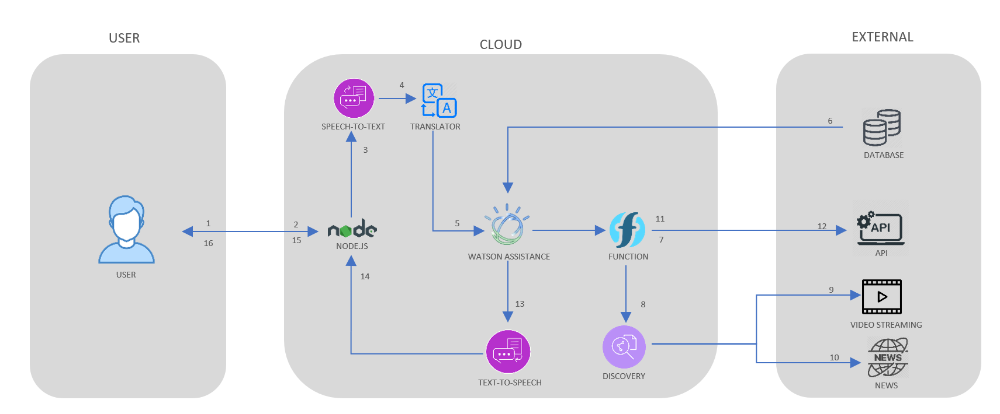
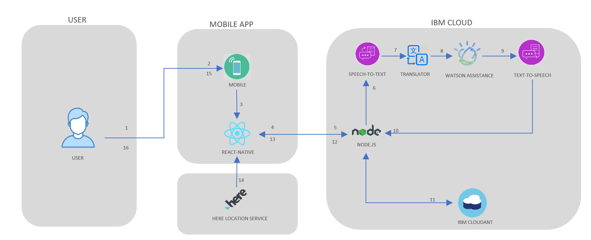

# Shuraksha-Bot
**Team Name:–** *half-a-byte* 
**Team Members:**
  - Prithiraj Nandan
  - Mousumi Dhar
  - Sourik Prakash Kabi
  - Spondita Ghosh
### Solution Brief Overview - 
#### The current scenario and the problem:
Coronavirus, the reason we are staying inside our home for the last few months. Planes are grounded, factories shut, countries from UK to India have implemented nationwide lockdowns, such grave is the situation. Roads are empty, people are working from home and tourist spots and local residences are now divided into red, orange and green zones. 
In many places people are facing problems of buying even basic commodities like groceries. Local shops have stopped home delivery, and now the only option left for the people is to move out of their houses which is a dangerous thing on its own and also to stand in long queues for a long time which is a grave thing to do as the COVID-19 virus spreads primarily through droplets of saliva or discharge from the nose when an infected person coughs or sneezes. 
Similar thing is happening in banks and pharmacies. People are standing in queues for hours and some even without masks. 
At this time, there are no specific vaccines or treatments for COVID-19 but we can protect ourselves and others from infection by washing our hands using an alcohol-based hand wash. But hand wash and sanitizers are not available in our home in unlimited quantity, they will run out without any warning and then we may face difficulty in keeping our hands sanitized. 
Most of the parents are staying at home but they are still working from home, so their children feel neglected, staying at home for a long time and also not being able to interact with their parents can be frustrating for them, and they might suffer from anxiety issues. 
**How can our technology *Shuraksha* help?** 
The best way to prevent and slow down transmission is be well informed about the COVID-19 virus, the disease it causes and how it spreads. And there comes our AI-enabled chatbot *“Shuraksha”*, it is built with the prime objective to keep people informed and aware and also to ease up daily life activities like shopping and to make it safer. 
## Working Model -

## Solution description-
As mentioned earlier, *Shuraksha* is an AI-enabled chatbot built to make your daily life activities easier and safer. The main objective of *Shuraksha* is to introduce the concept of **Virtual Queue**. Need to purchase some groceries? Inform *Shuraksha*. It’ll provide exact location of all nearby shops and along with it the proper directions to reach them. *Shuraksha* can help identify the nearest shop and then search for the number of customers present in that shop. If the **number of customers is greater** than 10, then it’ll reject that particular shop and select the next nearest shop and then apply the similar process. Upon meeting all the conditions, *Shuraksha* will inform the shopkeeper about the items the user needs, and it’ll provide the user a token number which can be used to fetch the items from the shopkeeper as soon as the user reaches the shop, thus avoiding the need to stand in long queue for a long time. 
So how did the **Virtual Queue** concept work? To explain it let us consider the example of **banks** and **pharmacies**. Every user upon informing Shuraksha about their needs will receive a token number based on first come first serve basis, that is, the user with smallest token number will get his/her work done first. **Apart from these tokens there will also be special extra coupons having highest priority which can be obtained based on urgency.** 
*Shuraksha* is an interactive chatbot it can provide answer to your questions like statistics of COVID-19 as well as other related FAQs and health tips. 
*Shuraksha* marks the home of the user and the surrounding radius of some fixed distance as the safest area for the user and whenever the user steps out of that safe zone, *Shuraksha* reminds him/her to use mask. Similarly, when the user returns from some place say the market which is outside the safe zone then *Shuraksha* will ask the user to sanitize his/her hands before entering the safe zone marked by *Shuraksha* (user’s home). It can even remind the user to refill sanitizers so that the user never runs out of sanitizer by purchasing sanitizers at the right time. 
*Shuraksha* can interact with people, and that can be pretty helpful for kids who felt bit neglected by their parents, *Shuraksha* can play rhymes for kids and even help in primary education. Thus, *Shuraksha* can also act as a source of entertainment as well as education for children. 
#### Basic functions of Shuraksha:
- Implementation of **Virtual Queue** and **Token system** in shops, banks, pharmacies, etc.
- **Tracking real time location of the user** to remind user to use mask and sanitizer whenever required.
-	Answering **FAQs** asked by the user.
-	**Entertainment** and **education** of children.
-	Giving **reminders** like “time to refill your sanitizer”, etc.
## Solution Architecture – 
- **This architecture explains the working of *Shuraksha* when it is involved in general interaction.**
 
1. The user visits the website or the mobile app to interact with *Shuraksha*, this interaction can be textual or lingual.
2. The Node.js web server connects the user with *Shuraksha*.
3. If the user is using the lingual mode interaction then IBM Speech-To-Text would help in speech recognition.
4. IBM translator is used if the user is using other language than English.
5. Now the user’s input reaches Watson Assistance and it converts natural language into machine language (if the user uses textual mode of interaction then step 3 and 4 are skipped).
6. General COVID related question are responded from trusted databases.
7. Watson Assistance invokes OpenWhisk opened-source powered IBM Cloud Function. 
8. IBM Cloud Function in turn invokes Watson Discovery running in IBM Cloud.
9. Watson Discovery scans appropriate video and responds with relevant videos.
10. Watson Discovery scans news articles and responds with relevant articles.
11. Watson Assistance invokes OpenWhisk opened-source powered IBM Cloud Function. 
12. IBM Cloud Function calls the COVID-19 API to get statistics.
13. IBM Text-To-Speech converts the gained data into speech.
14. The Node.js Web server receives the data.
15. The web server transfers the data to the user.
16. The user gets the data. 
- **This architecture explains how Shuraksha manage the Virtual Queue and Token System.**
 
1. The user visits the website or the mobile app to interact with *Shuraksha*, this interaction can be textual or lingual.
2. Mobile uses React-Native framework to implement the Watson Assistance Chat system.
3. React-Native framework communicate with Node.js Web Server.
4. Node.js receive the request to connect Watson which is running the Web.
5. Node.js Web server connect the user with Shuraksha.
6. If the user is using the lingual mode interaction then IBM Speech-To-Text would help in speech recognition.
7. IBM translator is used if the user is using other language than English.
8. Now the user’s input reaches Watson Assistance and it converts natural language into machine language (if the user uses textual mode of interaction then step 3 and 4 are skipped) and the perform the required actions.
9. IBM Text-To-Speech converts the gained data into speech.
10. The Node.js Web server receives the data.
11. The Virtual Queue and the Token System is managed by IBM Cloudant Service.
12. Node.js receives all the information.
13. Node.js transfers the data to React-Native framework.
14. React-Native all receives the Location of the shops from HERE Location Service.
15. The result is reflected back to the Mobile device.
16. User sees the data. 
## IBM Cloud Services/System -
- IBM Watson Assistance
- IBM Speech-To-Text
-	IBM Text-To-Speech
-	IBM Cloudant
-	IBM Cloud Function
-	IBM Discovery

